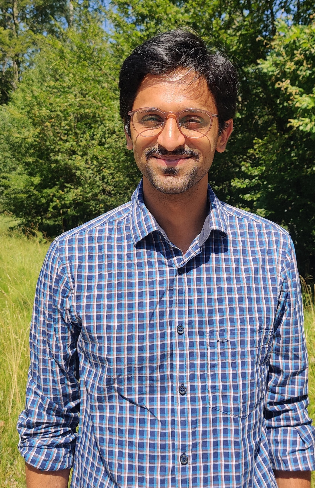
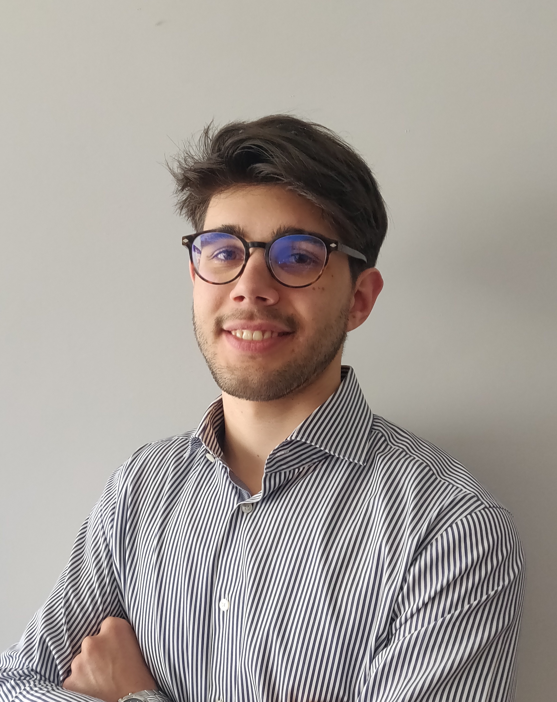

.. title: Members
.. slug: members
.. date: 2024-08-29 18:02:56 UTC+02:00
.. tags: 
.. category: 
.. link: 
.. description: 
.. type: text

### Group leader

Thejasvi Beleyur, Group Leader, [homepage](https://thejasvibr.github.io/index.html)

### Staff

Alberto Doimo, Research Assistant
 
Development of the Ro-BAT swarm robotics platform.

### Masters students
* Aditya Moger: Masters thesis (Integrated BS-MS, IISER Pune). Computational modelling of echolocating bat groups. 

### PhD candidates
We are looking for PhD candidates - see [openings here](/openings/)

### Postdocs 
We are looking for postdocs - see [openings here](/openings/)

### Alumni 
* Gabriele Baroli (2025):  Masters thesis  (Music & Acoustic Engineering, Politecnico Milano) 2024-25. Building the active-sensing V2 Ro-BAT.
* Alberto Doimo  (2024):  Masters thesis in Music & Acoustic Engineering, Politecnico Milano) . Building the  passive sensing V1 Ro-BAT.
* Julian Jandeleit (2022-23): Bachelors thesis in Computer Science, Uni. Konstanz. Multi-sensor alignment of featureless thermal and LiDAR cave scenes. 
* Giray Tandoğan (2021): Masters thesis in Computer & Information Science, Uni. Konstanz. Multi-animal, multi-camera tracking and correspondence matching.

## Collaborators 

None of this work happens in a vacuum. Here is the scientific community around our research projects:

### Swarm robotics 
* [Andreagiovanni Reina](https://www.giovannireina.com/) (CASCB, Uni. Konstanz)
* [Prof. Heiko Hamann](http://www.heikohamann.de/)

### Source localisation in complex audio
* Computer vision & machine learning group (Uni. Lund, Sweden)
	* [Prof. Kalle Åström](https://www.maths.lu.se/staff/kalleastrom/)
	* Max Modig
	* Erik Tegler 
	* Jens Gulin

### Computer vision
* Computer vision & image analysis group, [Prof. Bastian Goldluecke](https://www.cvia.uni-konstanz.de/) (Uni. Konstanz)

### Animal collective behaviour
* [Prof. Iain Couzin](https://www.ab.mpg.de/person/98158) (Uni. Konstanz/MPI Animal Behavior)

### Bio-acoustics
* Animal Ecology and Urban Communication group (Max-Planck Institute for Biological Intelligence, Seewiesen)
	* [Henrik Brumm](https://www.bi.mpg.de/brumm) 
	* Léna de Framond
* [Holger R. Goerlitz](https://www.holger-goerlitz.de/) (MPI-Biological Intelligence, Seewiesen)