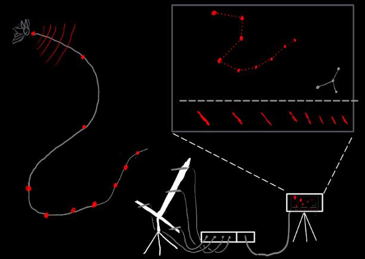
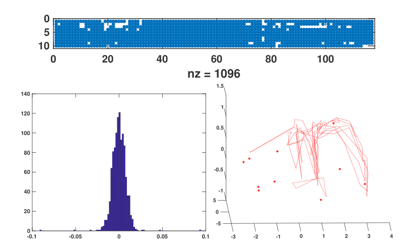

.. title: Openings
.. slug: openings
.. date: 2024-08-29 23:16:56 UTC+02:00
.. tags: 
.. category: 
.. link: 
.. description: 
.. type: text

## Masters thesis positions 

### 1. Developing a real-time bat-tracker
The field-behaviour of echolocating bats has always been studied in a ‘recording format’. Multi-channel audio is recorded  in the dark and 3D tracks are assembled later using acoustic tracking. The ‘post-hoc’ nature means there is never an intuitive understanding of what echolocators are doing out in nature - leaving both scientists and lay people clueless about why echolocators behaved a particular way.  This project will seek to address the observational gap by building a real-time tracking system that generates live localisations of bat calls as they fly in the dark. The tasks in this project include assembling a multi-channel microphone array, building a real-time acoustic tracking system in a portable format, microphone calibrations, along with validation tests in the lab and the field. Through this project you will develop experience and skills in handling ultrasound, acoustic-tracking and graphical-design.

 

*Schematic of what the real-time tracking workflow would look like in the field. The bat flies in the dark and emits calls (red dots), that are then tracked by the microphone array (on an inverted-T frame). The triangulated positions are then plotted in real-time onto a 3D visualisation that reflects the flight path of the bat in its natural environment.*

*Who this may interest* Are you interested in sound, technology, and animal behaviour? Establishing the real-time tracker will be a cool methodological jump for the field, as the live data can produce intuitive results from an animal behaviour perspective. 

You will be joining an inter-disciplinary lab with a working knowledge of acoustics, animal behaviour and swarm robotics -  check out the rest of the lab's website to get a fuller picture. 

Project related links

* [2D-realtimetracker](https://github.com/thejasvibr/tutorial_acoustictracking)
* [3d-acoustic-tracking](https://github.com/thejasvibr/batracker).

Start date: as soon as possible, with an expected 4-6 months of commitment. 

### 2. Making microphone self-positioning a reality

As it is right now, acoustic tracking with multiple mics is very laborous. You have to either use a fixed metal frame and put the mics in predetermined slots, or place the mics flexibly in the field site and then measure their XYZ coordinates laboriously.

Now, imagine if you could just place your mics wherever you wanted, run around the place with a speaker - and out come all the mic XYZ positions! This kind of automatic 'self-positioning' is already a reality in the multi-camera tracking world - but even though algorithms & proof-of-concepts are out there - no usable open-source implementations exist. Having a usable software + hardware workflow that allows microphone self-positioning  has the potential to transform how a lot of people use microphone arrays - from applied to basic science contexts. 

 

*Sample figure from Batstone et al. 2019 ICASSP. Top: The good time-difference-of-arrival fixes across multiple sweeps and channels. Bottom-left:The re-projection residuals for the inferred microphone xyz positions Bottom-right: The inferred speaker positions (red-lines) and microphone xyz coordinates (red-dots).*

In this project you will be implementing & integrating published self-positioning algorithms (coded in MATLAB, C and Python), developing easy to use experimental workflows for audible + ultrasound, and testing self-positioning accuracy through the use of our inhouse Total Station device. The final result will be a Python software package along with an easy to use experimental workflow.

*Who this may interest* Are you interested in Python, sound, and algorithms? Establishing the self-positioning package + workflow is for you! This work will be done with the joint supervision of [Prof. Kalle Astroem (Mathematical Imaging Group, Uni. Lund)](https://portal.research.lu.se/en/persons/kalle-%C3%A5str%C3%B6m/) and Thejasvi.

You will be joining an inter-disciplinary lab with a working knowledge of acoustics, animal behaviour, swarm robotics and scientific software engineering -  check out the rest of the lab's website to get a fuller picture. 

*Project related links*

* [Batstone et al. 2019 ICASSP](https://kops.uni-konstanz.de/entities/publication/a8dc4c95-3162-4a50-a5b2-ef2b3361df7c) - this is a proof-of-concept for discrete ultrasound playbacks done in a cave as part of the Ushichka dataset
* [Zhayida et al. 2016](https://arxiv.org/abs/1610.02392) - the sweeping description of the Structure From Sound framework developed in Kalle's group - along with tests using continuous audible sounds.

Start date: as soon as possible, with an expected 4-6 months of commitment. 

### Funding & application for the Masters thesis positions
Funding: The student will be hired as a [student-assistant (HiWi)](https://search.brave.com/search?q=what+is+a+HiWi) at the University of Konstanz, and will gain student status on registering at the University. Student-status provides a series of benefits and subsidies for life at the University and Konstanz. 

Application: Please reach out to Thejasvi via email. Include your CV and in the email briefly state why this project interests you, along with any relevant skill-sets you bring. 

## Phd/postdoc with your own funding/ideas
If the ideas and themes of the lab are generally interesting, or you have some ideas you'd like to realise in the form of a PhD/Postdoc or lab visit through your own funding please do get in touch. 

