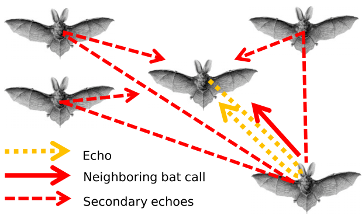

.. title: Active Sensing Collectives (Beleyur) Lab
.. slug: index
.. date: 2024-08-29 17:55:17 UTC+02:00
.. tags: 
.. category: 
.. link: 
.. description: 
.. type: text

## Active sensing and collectives
Active sensing agents like echolocating animals and robots/drones using RADAR/SONAR are well understood as individual agents. Broadly speaking, active-sensing agents emit 'probes' of energy into the environment, and perceive how this energy is modulated by objects in the environment. However, when active-sensing agents come together in groups, things aren't so simple anymore. With each agent emitting probes all the time, there's potential for jamming (emitted probes overlapping relevant signals), and even just confusion (whose probe is whose?). 
 

	
	

 
Despite the expected complexity of active-sensing in collectives, as usual, animals defy our imagination.
Echolocating bats are one of the most gregarious animals in the world, forming groups of tens to millions. How are individual agents managing to move together in these extremely information-limited settings, and what sensorimotor strategies are they using to move together in a cohesive group?

## Observe, model, compare, repeat. And build your own tools as you go.
The lab combines a multi-disciplinary thought process that combines rigorous modelling, in-field observations, and experiments (not necessarily in that order!).  While data is 'cheap to collect', finding the right tools and methods to analyse the often extremely unique datasets is not as cheap, or common. Another focus of our group is  to develop computational methods where needed, with the final goal being long-term community use. For more information on the research of the group, check out [this page](/research-themes/). 

## Who are we?
We are an interdisciplinary research group working at the interface of sensory biology, robotics and collective behaviour. We are based at the [Centre for the Advanced Study of Collective Behaviour](https://www.exc.uni-konstanz.de/collective-behaviour/) at the University of Konstanz. See [Members](/members/) for the latest ensemble of people and their projects. 

We are looking to grow - see [openings](/openings/).

## Rolling Updates

* 15 Sept 2025 : Welcome to Konstanz Frithjof! Frithjof is the lab's first PhD student, and the PhD is centred around the multi-sensor study of echolocating bats in the field.  

* 2nd June 2025 : We welcome Aditya to the ASC lab! Aditya will be doing his Masters thesis with us and studying echolocating groups and the consequences of various sensori-motor strategies using computational modelling. 

* 28th May 2025 : Farewell and all the best with writing up the thesis Gabriele! Gabriele gave his farewell talk today at the Scy-phy seminar series on the active-sensing Ro-BAT platform he developed over the course of his Masters thesis in the lab. 

* 21st March 2025 : We are looking to fill a PhD position characterising echolocating groups in the field is out. [Apply here](/openings/), deadline is May 25 2025!

* 1st March 2025 : The 'official' start date for the Active Sensing Collectives lab.

