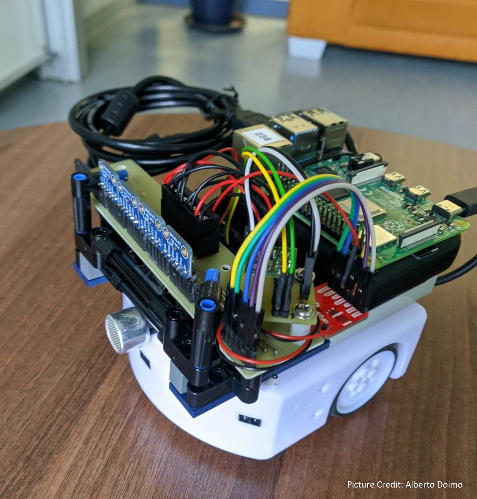
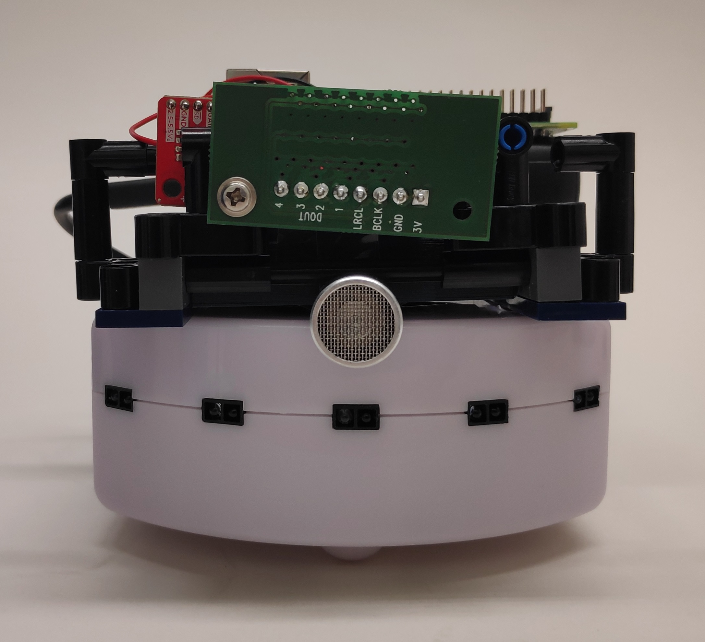
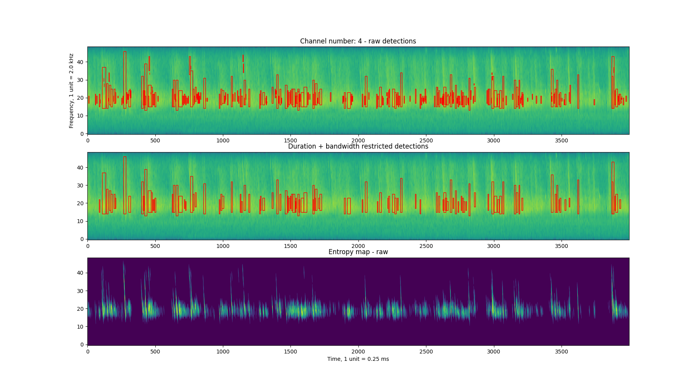
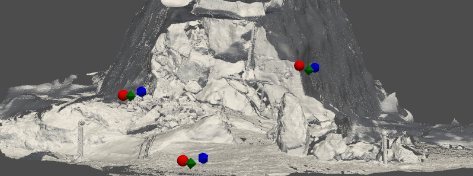

## Active-sensing collectives in the field: a high resolution, multi-sensor approach
Echolocating bats manage to navigate in complete darkness using only sound. A lot of our understanding of echolocation comes from investigations of individual bats studied under field and lab settings. Individual echolocation itself is no easy task, one call generates multiple overlapping echoes, and the bat must decide how to filter and process this stream of incoming echoes. 

 

<small>Left: The multi-sensor Ushichka dataset with a multi-channel microphone array, thermal cameras and LiDAR scans of the cave the bats flew in Right: A-C panels showing snippets of recorded data along with bat activity in D,E. </small>

 
The fact remains, echolocating bats are capable of *even more*. Bats are one of the most gregarious animals in the world, and are capable of flying in dense swarms in complete darkness only relying on echolocation. However, studying these dense swarms is not trivial - and here we use the latest techniques and algorithms to 1) reconstruct individual sensory inputs 2) rationalise individual sensorimotor decisions at high spatio-temporal resolution. 

## The swarm robotics of active-sensing agents
Echolocation is a pretty neat sensory modality. Being a 'single-sensor' modality, echolocation is also thus a data and computationally effective way to navigate your surroundings. This makes echolocation/SONAR a nice candidate for robotics, and specifically swarm robotics.

We use swarm robotics to understand active-sensing collectives from two perspectives 1) to explain and rationalise biologically seen behaviours 2) to experiment and discover new strategies to handle navigation in complex echolocation scenes. With our collaborators [Andreagiovanni Reina]() and [Heiko Hamann]() we have been developing the 'Ro-BAT' active-sensing swarm robotics platform. 

 

<small>Left: An early version of the V0 Ro-BAT with a widely separated mic array Right: A later version of the V0 Ro-BAT with a tight microphone array for better direction-of-arrival localisation </small>

 

## Methods development and collaboration
The data we collect comes along with its own quirks, meaning typical analysis tools may not really fit, or exist. A lot of available algorithms and methods are conceived with human or industrial use-cases in mind, and assume their properties as input (human speech, clean geometric shapes, etc.). We of course often end up studying the very oppostie of these human/industrial settings by going out in the night (next to trees, ponds, or in caves), and record data opportunistically. 
We approach the challenge of our unconventional datasets by either building the tools ourselves, or collaborating to develop and test new methods with our data.

### Algorithms for multi-channel, multi-source localisation
When multiple echolocators come together, a problem arises not only for the echolocators themselves, but also to those studying them (us!). How to extract audio data with overlapping sounds is an open problem that is still being looked into. Especially with multi-bat audio, there's sound directionality and reverberation.  In collaboration with [Kalle Åström (Uni. Lund)](https://portal.research.lu.se/en/persons/kalle-%C3%A5str%C3%B6m) and team we are looking into algorithms that work to localise sources in multi-channel audio with overlapping sounds, also while trying to test the efficacy of microphone array self-localisation in the field. 

     
	
<small>Left: Example of acoustic localisation points from reverberant audio. Right: A simple call detection workflow to perform localisation.</small>

### Multi-sensor alignment and workflows
Exploiting the availability of new sensor types, an important focus of the lab is to create a holistic understanding of how active-sensing agents manage in groups. However, the kinds of algorithms and sensors used in 'common' human/industrial contexts of course do not always work. In collaboration with [Bastian Goldlücke (Uni. Konstanz)](https://www.cvia.uni-konstanz.de/members/prof-dr-bastian-goldluecke/) we have been developing a workflow to align thermal camera scenes with LiDAR scans of cave scenes that do not have the typical sharp edges and contrasts that typical datasets have.

	 
	 
	
	
 <small> Top: The stages of the DMCP algorithm starting with thermal+LiDAR scenes to user-inputs Bottom: The final inferred positions  for the three thermal cameras in the cave.</small>

